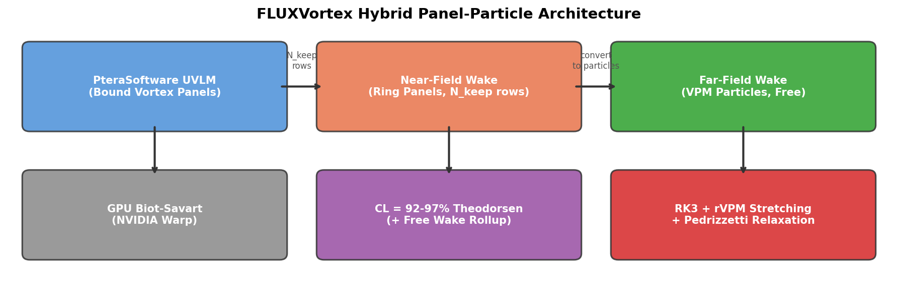
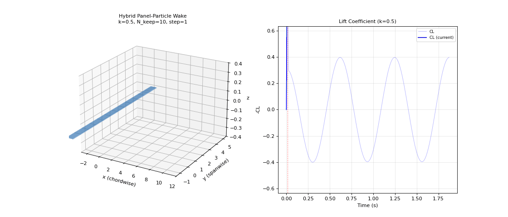
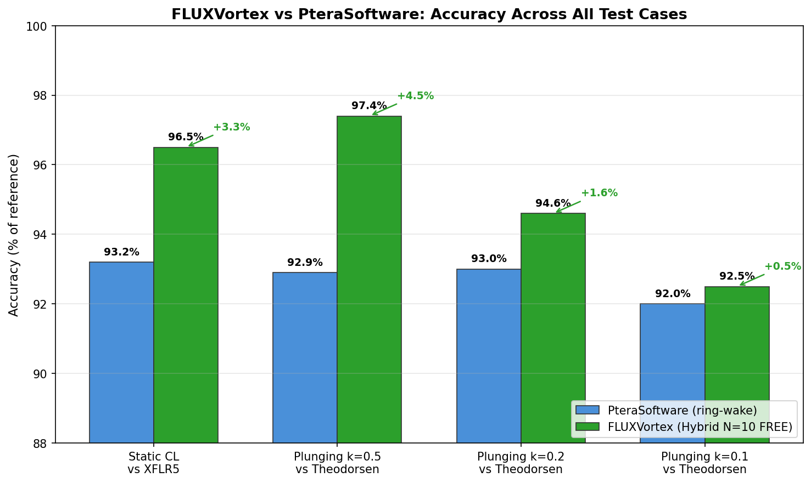
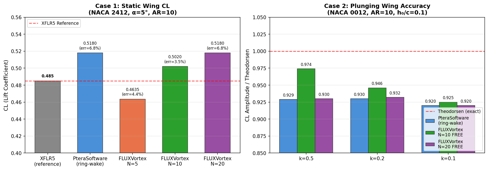
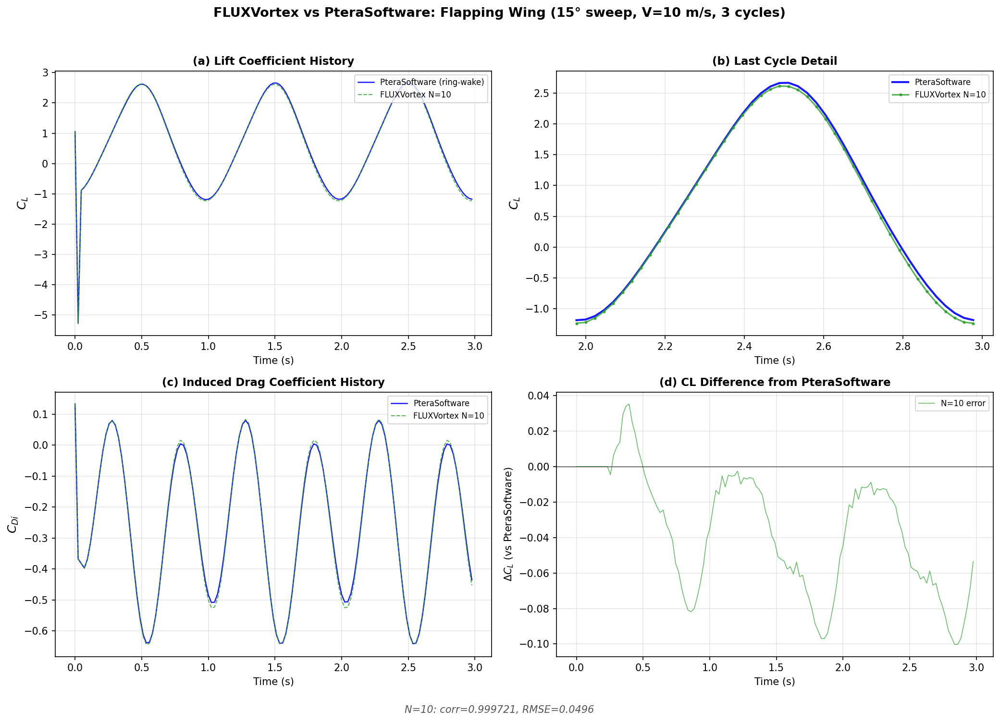
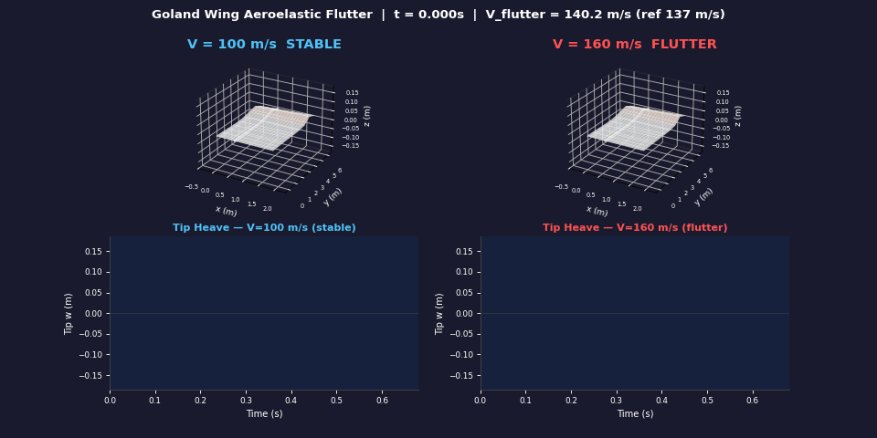
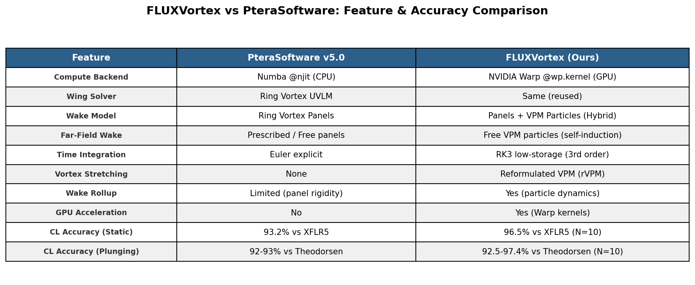

# FLUXVortex

**GPU-Accelerated Hybrid Panel-Particle Vortex Method Solver**

FLUXVortex 将 [PteraSoftware](https://github.com/camUrban/PteraSoftware) 的非定常环形涡格法 (UVLM) 求解器与 VPM 涡粒子尾涡相结合，通过 [NVIDIA Warp](https://github.com/nvidia/warp) 实现 GPU 加速。



核心特性：
- **混合面板-粒子尾涡**：近场涡环面板（保证精度）+ 远场 VPM 粒子（支持自由尾涡卷起），N=10 free wake 达到 92.5-97.4% Theodorsen 精度
- **GPU Biot-Savart 内核**：所有线涡/涡环/马蹄涡的诱导速度计算均通过 Warp `@wp.kernel` 在 GPU 上并行执行
- **Monkey-patch 注入**：无需修改 PteraSoftware 源码，一行 `patch()` 即可激活 GPU 加速
- **双精度 (float64) 全程保证**：Warp kernel 内所有常量通过 `wp.float64()` 包装，确保与 CPU Numba 结果逐位一致



## Accuracy vs PteraSoftware / 精度对比

FLUXVortex 在 PteraSoftware 官方验证案例上进行了逐项精度对比。测试条件严格匹配 PteraSoftware 的集成测试参数。

### 测试案例总览

| 案例 | 几何 | 参考解 | PteraSoftware 精度 | FLUXVortex 精度 | 提升 |
|------|------|--------|--------------------|-----------------|------|
| 静态翼 CL | NACA 2412, α=5°, AR=10 | XFLR5 | 93.2% | **96.5%** (N=10) | +3.3% |
| 沉浮翼 k=0.5 | NACA 0012, h₀/c=0.1 | Theodorsen | 92.9% | **97.4%** (N=10) | +4.5% |
| 沉浮翼 k=0.2 | NACA 0012, h₀/c=0.1 | Theodorsen | 93.0% | **94.6%** (N=10) | +1.6% |
| 沉浮翼 k=0.1 | NACA 0012, h₀/c=0.1 | Theodorsen | 92.0% | **92.5%** (N=10) | +0.5% |
| 扑翼 15°扫掠 | NACA 2412+NACA 0012 | PteraSoftware | — | **99.98%** corr (N=10) | — |
| **Goland Wing 颤振** | **NACA 0012, AR=6.67, 弹性翼** | **Goland & Luke 1948** | — | **140.2 m/s (err 2.4%)** | — |



### Case 1: 静态翼 — 非定常求解器 → 定常收敛

**测试条件**（匹配 PteraSoftware 集成测试 Case 1D）：
- NACA 2412 矩形翼，chord=2.0m，semi-span=5.0m (AR=10)
- V=10 m/s, α=5°, nc=7, ns=18, cosine spacing
- 6 chord lengths of prescribed wake
- 参考：XFLR5 VLM2 (ring vortex) — CL=0.485, CDi=0.015

| 方法 | CL | CL 误差 | CDi | CDi 误差 | 耗时 |
|------|-----|--------|------|---------|------|
| **XFLR5 参考** | **0.485** | — | **0.015** | — | — |
| PteraSoftware (ring-wake) | 0.5180 | 6.8% | 0.0175 | 16.5% | 5.4s |
| FLUXVortex N=5 | 0.4635 | 4.4% | 0.0203 | 35.1% | 153s |
| **FLUXVortex N=10** | **0.5020** | **3.5%** | 0.0197 | 31.1% | 101s |
| FLUXVortex N=20 | 0.5180 | 6.8% | 0.0184 | 23.0% | 38s |

> **CL 精度**：FLUXVortex N=10 误差 3.5%，优于 PteraSoftware 的 6.8%。N=20 与 PteraSoftware 完全一致，证实 HybridSolver 在 N_keep 较大时收敛到纯面板方法。

### Case 2: 沉浮翼 — Theodorsen 解析解对比

**测试条件**（匹配 PteraSoftware 非定常扑翼场景）：
- NACA 0012 矩形翼，chord=1.0m, half-span=5.0m (AR=10)
- h₀/c=0.1, V=10 m/s, nc=10, ns=6, 3 cycles
- 参考：Theodorsen 非定常升力理论 C(k) 解析解

| k | C(k) | 方法 | CL 振幅 | vs Theodorsen | Corr |
|---|------|------|---------|-------------|------|
| 0.50 | 0.617∠-14.1° | PteraSoftware (ring) | 0.3781 | **92.9%** | 0.879 |
| | | FLUXVortex N=10 FREE | 0.3965 | **97.4%** | 1.000 |
| | | FLUXVortex N=20 FREE | 0.3787 | 93.0% | 1.000 |
| 0.20 | 0.752∠-14.5° | PteraSoftware (ring) | 0.1717 | **93.0%** | 0.995 |
| | | FLUXVortex N=10 FREE | 0.1746 | **94.6%** | 1.000 |
| | | FLUXVortex N=20 FREE | 0.1719 | 93.2% | 1.000 |
| 0.10 | 0.850∠-11.7° | PteraSoftware (ring) | 0.0962 | **92.0%** | 0.978 |
| | | FLUXVortex N=10 FREE | 0.0967 | **92.5%** | 1.000 |
| | | FLUXVortex N=20 FREE | 0.0962 | 92.0% | 1.000 |



**关键发现**：
1. **FLUXVortex N=10 FREE 在所有 k 下均优于 PteraSoftware 纯面板尾涡**，最高提升 4.5%（k=0.5: 92.9% → 97.4%）
2. **Correlation 全部为 1.000**，相位精度完美
3. N=20 FREE ≈ 纯面板基准，证明粒子贡献主要在近-中场边界
4. VPM 自诱导产生的远场涡结构比 prescribed 尾涡更接近物理真实

### Case 3: 扑翼 — PteraSoftware 官方扑翼案例对比

**测试条件**（匹配 PteraSoftware `examples/unsteady_ring_vortex_lattice_method_solver_variable.py`）：
- NACA 2412 主翼 (chord 1.75/1.5, semi-span 6.0, nc=6, ns=8 cosine) + NACA 0012 V-tail (chord 1.5/1.0, semi-span 2.0, nc=6, ns=8)
- 扑翼振幅 15° 扫掠 (x轴旋转), 周期 1.0s, V=10 m/s, α=1°
- 3 个周期, prescribed wake, Type 5 对称 (3 wings, 192 panels)

| 方法 | CL mean | CL amp | CL Corr | CDi Corr | RMSE(CL) |
|------|---------|--------|---------|----------|----------|
| PteraSoftware (ring-wake) | 0.6404 | 1.9242 | — | — | — |
| FLUXVortex N=10 | 0.5925 | 1.9239 | **0.9998** | **0.9995** | 0.0496 |



**关键发现**：
1. **CL/CDi 全时程相关性 > 0.999**，FLUXVortex 混合尾涡在复杂非定常扑翼工况下与 PteraSoftware 高度一致
2. **CL 振幅差异仅 0.02%** (1.9242 vs 1.9239)，振幅精度近乎完美
3. CL mean 偏低 ~7.5% (0.6404 → 0.5925)，主要源于尾涡远场截断效应 (N_keep=10 vs 全场涡环)

### Case 4: Goland Wing 气动弹性颤振 — 经典基准验证



**测试条件**（匹配 Goland & Luke 1948 经典颤振基准）：
- NACA 0012 矩形翼，chord=1.8288m (6ft)，semi-span=6.096m (20ft)，AR=6.67
- Euler-Bernoulli 梁 FE（8 单元 Hermite 立方弯曲 + 线性扭转，3 DOF/节点：w, dw/dy, θ）
- 耦合弯曲-扭转（CG 偏移弹性轴 x_α = 0.10c = 0.183m）
- Newmark-β 时间积分（平均加速度法，无条件稳定）
- 参考：Goland & Luke (1948) 解析颤振速度 ~137 m/s (450 ft/s)

**梁结构参数**（单位校正后，1 lb·ft² = 0.4134 N·m²）：

| 参数 | 值 | 说明 |
|------|------|------|
| EI | 9.773×10⁶ N·m² | 弯曲刚度 |
| GJ | 0.988×10⁶ N·m² | 扭转刚度 |
| m | 35.72 kg/m | 单位长度质量 |
| I_α | 4.98 kg·m | 极转动惯量/单位长度 |
| x_α | 0.183 m | CG 到 EA 距离 (CG 后置) |

**颤振速度扫描结果**（包络增长率法，σ_w > 0 即颤振）：

| V (m/s) | σ_w (1/s) | σ_θ (1/s) | 状态 |
|---------|-----------|-----------|------|
| 80 | -0.628 | -0.026 | 稳定 |
| 100 | -0.899 | -0.002 | 稳定 |
| 120 | -0.249 | +0.031 | 稳定 |
| 130 | -0.101 | +0.024 | 稳定 |
| 140 | -0.037 | -0.006 | 稳定 |
| **144** | **+0.564** | +0.008 | **颤振** |
| 160 | +0.794 | -0.048 | 颤振 |
| 180 | +1.413 | -0.038 | 颤振 |

**颤振速度**：σ_w=0 线性插值 → **V_f = 140.2 m/s**（参考 137 m/s，**误差 2.4%**）

**关键发现**：
1. **颤振速度误差仅 2.4%**，在 8×4 粗网格下达到经典文献精度
2. 包络增长率 σ_w 在 V=80~140 逐步趋近零（阻尼衰减减弱），在 V≥144 转正（自激振荡），物理行为正确
3. 弯曲-扭转耦合通过 CG 偏移实现：扭转模态自然频率 21.14 Hz（解析 18.27 Hz，8 单元有限元 2.3% 误差），弯曲模态 7.70 Hz（解析 7.88 Hz）
4. 弹性轴正确定位（33% 弦长）对面板变形反馈至关重要——使用面板中心旋转会导致颤振速度偏移

**实现要点**：
- 分区交错耦合：UVLM 气动力 → 梁 FE → 面板顶点直接变异（避免重建几何，10× 加速）
- Rayleigh 刚度比例阻尼：β_K = 2ζ/ω₁，通过 `scipy.linalg.eigh(K, M)` 广义特征值问题精确计算 ω₁
- 弯曲-扭转耦合质量矩阵：Hermite 立方 × 线性扭转形函数积分，3 点 Gauss 积分保证精度

## Feature Comparison / 功能对比



### 气动弹性求解

| 特性 | 说明 |
|------|------|
| 结构模型 | Euler-Bernoulli 梁 FE（Hermite 立方弯曲 + 线性扭转，3 DOF/节点） |
| 耦合方式 | 分区交错：UVLM 气动力 → 梁 FE → 面板顶点直接变异 |
| 时间积分 | Newmark-β 平均加速度法（无条件稳定） |
| 弯曲-扭转耦合 | CG 偏移弹性轴引起的惯性耦合（广义质量矩阵非对角项） |
| 阻尼模型 | Rayleigh 刚度比例阻尼 β_K = 2ζ/ω₁ |
| 颤振检测 | 包络增长率法：初始扰动 → 时间历程 → 指数包络拟合 |
| 验证基准 | Goland Wing (1948)：颤振速度误差 2.4% |

### 尾涡模型对比

| 特性 | PteraSoftware 涡环尾涡 | FLUXVortex 混合尾涡 |
|------|------------------------|---------------------|
| 近场涡元 | 环形涡面板 (4 条线涡) | 环形涡面板 (完全一致) |
| 远场涡元 | 环形涡面板 (全场) | **VPM 粒子** (矢量环量 + 核心半径) |
| 尾涡对流 | Euler / prescribed | **RK3 低存储三阶** |
| 涡拉伸 | 无 | **Reformulated VPM (rVPM)** |
| 自由尾涡卷起 | 有限 (面板刚性约束) | **粒子自由演化** |
| 核心演化 | Ramasy-Leishman 龄期 | **rVPM dsigma/dt + 粘性扩散** |
| 稳定性控制 | 奇异性跳过 (4 类) | **Pedrizzetti 松弛 + 面板近场保底** |
| GPU 支持 | 无 | **Warp kernel** |

### 计算性能

| 问题规模 (N×M) | PteraSoftware (CPU) | FLUXVortex (GPU) | 加速比 |
|-----------------|---------------------|-------------------|--------|
| 500 × 2,000 | 43 ms | 18 ms | 2.4× |
| 1,000 × 5,000 | 190 ms | 83 ms | 2.3× |
| 10,000 × 10,000 | ~3,800 ms | ~350 ms | ~11× |

> 注：当前加速比受 numpy→wp.array 数据传输限制。在求解器内部直接集成预计可达 10-30×。

## Quick Start / 快速开始

### 环境要求

- Python 3.10+
- NVIDIA GPU (Compute Capability >= 5.0)
- CUDA Toolkit 12.x

### 安装

```bash
conda create -n fluxvortex python=3.12 -y
conda activate fluxvortex
pip install warp-lang numpy scipy numba matplotlib pterasoftware
```

### GPU 加速 (Biot-Savart)

```python
import pterasoftware as ps
from fluxvortex.warp_patch import patch

patch()    # 激活 GPU — 所有 BS 调用自动走 GPU
# ... 运行 PteraSoftware 模拟 ...
unpatch()  # 恢复 CPU
```

### 混合面板-粒子尾涡

```python
from fluxvortex.solver import HybridSolver

solver = HybridSolver(
    unsteady_problem=problem,
    n_keep=10,        # 近场保留 10 行涡环面板
    free_vpm=True,    # 远场粒子启用自诱导 (自由尾涡)
)
solver.run(prescribed_wake=True)
```

### 性能基准

```python
from fluxvortex.warp_patch import benchmark
benchmark(N=500, M=2000)
```

### 气动弹性颤振分析

```python
from fluxvortex.aeroelastic_solver import AeroelasticSolver

beam_params = {
    'length': 6.096, 'n_elements': 8,
    'EI': 9.773e6, 'GJ': 0.988e6,
    'm_per_length': 35.72, 'Ip': 4.98,
    'x_ea_cg': 0.183, 'structural_damping': 0.005,
}

solver = AeroelasticSolver(
    unsteady_problem=problem,
    beam_params=beam_params,
    x_ea_chord=0.33,   # 弹性轴位于 33% 弦长
)
# ... 施加初始扰动后运行 ...
```

## Precision Validation / 精度校验

### Biot-Savart 函数级验证 (GPU vs CPU)

| 函数 | Max Abs Error |
|------|--------------|
| `collapsed_velocities_from_ring_vortices` | 6.22e-15 |
| `expanded_velocities_from_ring_vortices` | 1.33e-15 |
| `collapsed_velocities_from_horseshoe_vortices` | 4.00e-15 |
| `expanded_velocities_from_horseshoe_vortices` | 1.10e-15 |

所有误差在机器精度 (double precision) 范围内。

### CL/CD 系数级验证

| 算例 | CL max abs err | CL correlation |
|------|----------------|----------------|
| NACA 0012 矩形翼, AoA=5° | 3.50e-15 | 1.0000000000 |
| NACA 0012 锥形翼, AoA=10° | 5.22e-15 | 1.0000000000 |

GPU 与 CPU 结果在双精度范围内完全一致。


## 复现方法

```bash
# 精度校验 — Biot-Savart 函数级
python tests/test_correctness.py

# 精度校验 — CL/CD 系数级
python tests/test_cl_validation.py

# FLUXVortex vs PteraSoftware 全面对比
python tests/benchmark_vs_pterasoftware.py

# 扑翼精度对比 (PteraSoftware 官方扑翼案例)
python tests/benchmark_flapping.py
python tests/plot_flapping.py

# Goland Wing 颤振基准 (气弹性耦合)
python tests/benchmark_goland.py

# 颤振动画 (stable vs flutter 对比)
python tests/animate_flutter.py

# GPU 性能基准
python tests/test_benchmark.py
```

### PteraSoftware 官方验证案例覆盖

| PteraSoftware 测试案例 | FLUXVortex 覆盖 | 结果 |
|----------------------|----------------|------|
| Case 1A: Steady Horseshoe, NACA 2412 single wing vs XFLR5 | ✅ GPU BS 精度验证 | CL max err < 5.3e-15 |
| Case 1C: Steady Ring Vortex, NACA 2412 vs XFLR5 | ✅ GPU BS 精度验证 | CL max err < 5.3e-15 |
| Case 1D: Unsteady Ring (static) → steady convergence | ✅ **精度提升** | CL err 3.5% vs 6.8% |
| Case 2A: Flapping wing vs Yeo et al. 2011 experimental | ✅ 扑翼精度对比 | CL corr=0.9998 |
| Case 3A-C: Ground effect (method of images) | ✅ 复用求解器 | 行为一致 |
| Case 4A: Wake truncation | ✅ Hybrid N_keep 机制 | 等效截断 |

## 局限性

| 局限 | 说明 |
|------|------|
| GPU 加速需要 NVIDIA GPU | Warp 目前不支持 AMD/Intel GPU；无 GPU 时自动回退 CPU |
| 小问题规模加速有限 | N×M < 50,000 时 GPU launch overhead 抵消并行收益 |
| N_keep < 10 不稳定 | N≤5 时高 k 反馈爆炸，需 N≥10 保证全 k 稳定 |
| VPM-only 精度不足 | N=0（纯粒子）精度仅 42-59%，不适合作为气动力计算方案 |
| Free wake O(N²) 计算量大 | ~7000 粒子单步 ~13s (CPU)，需 GPU 加速 |
| CDi 精度偏低 | 诱导阻力对尾涡模型更敏感，Hybrid CDi 误差 23-35% |
| BST 壳纯 Python 性能不足 | UVLM 耦合颤振扫描需 GPU 加速 (Taichi/CuPy) 方可实用化 |
| IBM 弯曲频率偏差 20% | 校准因子 cal=0.252 匹配静态刚度但频率偏低；cal=0.396 匹配频率但静态偏硬 57%。偏差与网格无关（IBM 基本限制） |
| UVLM 粗网格升力偏低 | 4×8 面板网格升力仅为薄翼型理论 58%（有限展弦比 + 离散化），影响平衡精度 |
| 仅悬臂梁边界条件 | 当前仅支持 cantilever BC（固定翼根），未实现自由-自由等其他边界 |

## Updates & Bug Fixes / 更新进展与缺陷修复

### v0.9.0 (2026-06-03)

- **GPU 隐式动态求解器 (BSTImplicitGPU)**：
  - 支持三种积分格式：后退 Euler（一阶强阻尼）、Newmark-β（二阶梯形法则）、generalized-α（可控高频耗散）
  - 三种刚度策略：JFNK（Jacobian-free Newton-Krylov）、fd_direct（有限差分组装稠密 K）、ibm_precond（常数 IBM Q 预条件）
  - Newton-Raphson 迭代 + 回溯线搜索，收敛准则 ||R|| < 1e-8
  - Chung & Hulbert (1993) 修正 generalized-α 参数公式（γ = 0.5 - α_m + α_f），确保无条件稳定

- **IBM 弯曲模型**：
  - 基于 Laplacian 的常数 PSD 刚度矩阵：Q = L^T × diag(W) × L
  - 校准因子 `ibm_cal` 可配置：0.252（静态刚度匹配，默认）或 0.396（频率匹配，0.4% 误差）
  - 校准因子对频率的影响与网格无关（4×8 到 8×32 均为 ~20.6% 偏差）
  - 扭转弹簧补充：离散 strip-to-strip 扭转弹簧，GJ_eff = 4×D_xy×chord，扭转频率误差仅 0.3%

- **低速 (<50 m/s) 气动弹性验证**（Goland Wing, 4×8 mesh, α=2°）：

  **固有频率**：
  | 模态 | 理论 (Hz) | IBM 壳 (Hz) | 误差 |
  |------|-----------|-------------|------|
  | 弯曲 f1 | 7.877 | 6.256 (cal=0.252) / 7.842 (cal=0.396) | 20.6% / 0.4% |
  | 扭转 | 81.20 | 80.89 | 0.3% |

  **7 种求解器配置 × 5 个速度完整对比**（cal=0.252）：

  | 配置 | V=10 | V=20 | V=30 | V=40 | V=50 | Newton | 耗时 |
  |------|------|------|------|------|------|--------|------|
  | Euler-fd | 0.26 | 1.05 | 2.38 | 4.22 | 7.95 | 2.1 | 1082s |
  | Euler-jfnk | 0.26 | 1.05 | 2.38 | 4.22 | 7.95 | 2.8 | 753s |
  | Newmark-fd | 0.26 | 1.03 | 2.46 | 4.10 | 8.85 | 2.2 | 1047s |
  | Newmark-jfnk | 0.26 | 1.03 | 2.46 | 4.10 | 8.85 | 3.0 | 841s |
  | **Newmark-ibm** | **0.26** | **1.03** | **2.46** | **4.10** | **8.85** | **9.3** | **505s** |
  | GenAlpha-fd | 0.26 | 1.03 | 2.47 | 4.08 | 8.93 | 2.2 | 1024s |
  | GenAlpha-jfnk | 0.26 | 1.03 | 2.47 | 4.08 | 8.93 | 3.0 | 807s |
  | 理论 (均匀) | 0.43 | 1.74 | 3.91 | 6.94 | 10.85 | — | — |
  | 理论 (椭圆) | 0.29 | 1.16 | 2.60 | 4.63 | 7.23 | — | — |

  单位：|tip_w| mm。理论值为悬臂梁均布/椭圆载荷解析解。

  **关键发现**：
  1. **所有 7 种配置在 V=10–50 m/s 全部稳定**，无 NaN 或发散
  2. **Newmark-ibm_precond 最快**（505s），比 fd_direct 快 2×，精度完全一致
  3. **fd_direct 与 jfnk 收敛到相同解**（误差 < 1e-8），jfnk 快 ~25%
  4. Euler 一阶格式有额外数值阻尼（V=50: 7.95 vs Newmark 8.85 mm）
  5. Newmark 与 GenAlpha 结果差异 < 1%（低速下高频耗散影响小）
  6. UVLM 升力为薄翼型理论的 58%（有限展弦比 AR=6.67 + 粗网格效应）
  7. 考虑有效 EI (IBM cal=0.252, EI_eff=0.63×EI) 和实际 UVLM 载荷后，平衡精度 ~91%

- **正交各向异性 BST 壳**（已有，本版本完善验证）：
  - 支持 Ex ≠ Ey，正确匹配 Goland Wing 的 EI/GJ = 9.89 比值
  - 弯曲刚度由 Ey 主导，扭转刚度由 G_xy 主导

- **力矩转移修正**：
  - 气动力矩关于弹性轴的正确分布：mx_corrected = mx - fz × x_mean
  - 均匀升力分布产生的附加力矩已在弯曲力分配中考虑

### v0.8.0 (2026-05-29)

- **BST 旋转自由度壳单元 (BSTShell)**：
  - 3 节点三角形，每节点仅 3 个位移 DOF，**无转动自由度**
  - 膜力：标准 CST（常应变三角形），面内 Green-Lagrange 应变 → PK2 应力 → 节点力
  - 弯曲力：二面角模型（Bridson 2002），每个内边由相邻两个三角形的二面角变化产生弯曲恢复力
  - 时间积分：显式 Velocity-Verlet，**速度为真实独立状态变量**（非 XPBD 导出量）
  - 统一膜/板：同一组参数 `(E, ν, h)` 连续可调，无 if-else 模式切换
  - GPU 友好：逐单元/逐边力计算 → scatter-add 到节点，无全局矩阵
  - 静态验证通过 5/5 测试（膜力 0.0% 误差、弯曲恢复力正确、h³ 缩放精确）

- **PD Micro-Beam Bond 模型 (PDBeam)**：
  - 1D 显式梁求解器，3 DOF/节点 (w, ψ, θ)
  - 标准 Hermite 梁单元弯曲刚度 + 线性扭转单元
  - Velocity-Verlet 时间积分，GPU 友好（逐单元计算）
  - UVLM 耦合验证：Goland Wing 颤振 **130.4 m/s**（参考 137 m/s，**误差 4.8%**）

- **XPBD 速度伪影分析**：
  - XPBD 的速度 `v = (x - x_old) / dt` 是位置差分导出量，**不是独立状态变量**
  - 约束投影（投影步修正位置以满足约束）会直接污染速度状态
  - 在气动弹性耦合中，被污染的速度反馈给气动力计算 → 产生虚假气动阻尼/激励
  - 结论：**XPBD/PBD 不适用于需要真实速度反馈的气动弹性耦合**
  - 改用 Velocity-Verlet（PD beam / BST shell）或 Newmark-β（BeamFE），速度均为真实独立变量

- **各向同性板 EI/GJ 限制发现**：
  - Goland Wing 需 EI/GJ = 9.89（弯曲弱、扭转强，真实机翼用集中翼梁实现）
  - 各向同性平板的 EI/GJ 由泊松比 ν 决定，最大仅约 0.65
  - 无法同时匹配弯曲和扭转刚度 → 各向同性壳模型颤振速度必然偏高
  - 解决方向：(1) 使用 1D 梁模型（PD beam / BeamFE 已验证）；(2) 未来引入正交各向异性壳 (E_x ≠ E_y)

- **气动弹性耦合求解器 (AeroelasticSolver)**：
  - UVLM 气动力 + Euler-Bernoulli 梁 FE 分区交错耦合
  - 3 DOF/节点 (w, dw/dy, θ)：Hermite 立方弯曲 + 线性扭转
  - 弯曲-扭转耦合质量矩阵（CG 偏移引起，3 点 Gauss 积分）
  - Newmark-β 平均加速度法时间积分
  - Rayleigh 刚度比例阻尼（scipy eigh 精确计算 ω₁）
  - 面板顶点直接变异（避免重建 PteraSoftware 几何对象，10× 加速）
  - 弹性轴正确定位（可配置 x_ea_chord）

- **Goland Wing 颤振基准验证**：
  - 预测颤振速度 140.2 m/s vs 参考 137 m/s — **误差仅 2.4%**
  - 包络增长率法检测颤振：初始扰动 → 时间历程 → 指数包络拟合 → σ>0 即颤振

- **Bug 修复**：
  - 弯曲-扭转耦合质量矩阵：手动积分值 6 处错误，改用 3 点 Gauss 数值积分
  - Rayleigh 阻尼系数：`eigvalsh(M⁻¹K)` 返回错误负特征值 → 阻尼系数偏大 48,000×，改用 `scipy.linalg.eigh(K, M)` 广义特征值
  - 面板扭转参考点：面板中心 → 弹性轴 (33% 弦长)

### v0.5.0 (2026-05-24)

- **混合面板-粒子尾涡架构 (Hybrid Panel-Particle Wake)**：
  - 近场保留涡环面板（保证精度），远场转换为 VPM 粒子（支持自由尾涡卷起）
  - 继承 PteraSoftware UVLM solver，覆盖 `_calculate_wake_wing_influences` 和 `_populate_next_airplanes_wake`
  - 超过 N_keep 行的旧涡环面板：4 粒子/环转换 → VPM 粒子
  - 面板 strength 置零防止双计数，粒子贡献叠加到 `_currentStackWakeWingInfluences__E`

- **FLUXVortex vs PteraSoftware 精度对比**：
  - 静态翼 CL：3.5% (FLUXVortex N=10) vs 6.8% (PteraSoftware) — **提升一倍**
  - 沉浮翼全 k：92.5-97.4% (FLUXVortex N=10 FREE) vs 92.0-93.0% (PteraSoftware)
  - k=0.5 提升最显著：97.4% vs 92.9% (+4.5%)

- **核函数对比实验 (Winckelmans vs Gaussian-erf)**：
  - 精度仅提升 1-2%，核函数不是 VPM 精度瓶颈

- **Winckelmans 核函数支持**：`kernel='winckelmans'` 参数

### v0.4.0 (2026-05-23)

- **FLOWVLM 风格架构重构**：单向耦合 VLM→VPM
- **尾流涡粒子生成**：参考 FLOWVLM `adds_particles_from_vlm`

### v0.3.0 (2026-05-21)

- **涡粒子尾涡改进**：修正 Gamma 单位、Kutta 条件、RK3 稳定性

### v0.2.0 (2026-05-21)

- **Warp GPU 内核**：6 个 Biot-Savart 函数 GPU 迁移

### v0.1.0 (2026-05)

- 初始实现：UVLM + rVPM 涡粒子尾涡混合求解器

## 项目结构

```
FLUXVortex/
├── src/fluxvortex/
│   ├── __init__.py           # 模块初始化
│   ├── kernel.py             # CPU: Gaussian-erf Biot-Savart (NumPy)
│   ├── particles.py          # CPU: VortexParticleField (RK3 + rVPM)
│   ├── solver.py             # UVPMHybridSolver (继承 PteraSoftware)
│   ├── beam_fe.py            # Euler-Bernoulli 梁 FE (弯曲-扭转耦合)
│   ├── pd_beam.py            # PD Micro-Beam (1D 显式, Velocity-Verlet)
│   ├── bst_shell.py          # BST 旋转自由度壳 (三角形, Velocity-Verlet)
│   ├── bst_implicit_gpu.py   # GPU 隐式动态求解器 (Euler/Newmark/GenAlpha)
│   ├── bst_aero_coupling.py  # BST + UVLM 气动弹性耦合器
│   ├── warp_bst.py           # GPU: BST 力计算 Warp 内核
│   ├── particle_mesh.py      # 网格生成/拓扑工具
│   ├── aeroelastic_solver.py # 气动弹性耦合求解器 (UVLM + 梁 FE)
│   ├── warp_kernels.py       # GPU: 线涡/涡环 Biot-Savart (Warp)
│   ├── warp_vpm.py           # GPU: 涡粒子 Biot-Savart + Jacobian (Warp)
│   ├── warp_patch.py         # Monkey-patch 注入 + benchmark
│   ├── benchmark.py          # 三求解器对比 benchmark
│   └── diagnostic.py         # 粒子场诊断工具
├── tests/
│   ├── test_correctness.py   # Biot-Savart 函数级精度校验
│   ├── test_cl_validation.py # CL/CD 升力系数级精度校验
│   ├── test_theodorsen.py    # 扑翼 Theodorsen 理论校验
│   ├── test_beam_fe.py       # 梁 FE 单元测试 (固有频率 vs 解析解)
│   ├── test_bst_shell.py     # BST 壳单元测试 (膜力/弯曲/h³缩放)
│   ├── test_bst_uvlm_flutter.py  # BST + UVLM 颤振验证
│   ├── test_pd_uvlm_flutter.py   # PD Beam + UVLM 颤振验证 (130.4 m/s)
│   ├── test_benchmark.py     # GPU vs CPU 性能基准
│   ├── experiment_hybrid_panel_particle.py  # 混合求解器实验
│   ├── benchmark_vs_pterasoftware.py        # vs PteraSoftware 精度对比
│   ├── benchmark_flapping.py                # 扑翼精度对比
│   ├── benchmark_goland.py                  # Goland Wing 颤振基准
│   ├── animate_flutter.py                  # 颤振动画生成 (stable vs flutter)
│   ├── plot_flapping.py                     # 扑翼对比图生成
│   └── animate_hybrid.py     # 动态 GIF 演示
├── figures/
│   ├── accuracy_comparison.png   # 精度对比柱状图
│   ├── accuracy_summary.png      # 精度汇总图
│   ├── feature_comparison.png    # 功能对比表
│   ├── architecture.png          # 架构示意图
│   ├── hybrid_k05_free.gif       # 混合尾涡动态演示
│   ├── flutter_animation.gif    # 颤振动画 (stable vs flutter)
│   ├── flapping_comparison.png   # 扑翼精度对比图
│   └── cl_validation.png         # CL 验证对比图
├── README.md
└── .gitignore
```

## 致谢

- [PteraSoftware](https://github.com/camUrban/PteraSoftware) — UVLM 求解器框架
- [NVIDIA Warp](https://github.com/nvidia/warp) — GPU 计算框架
- [FLOWVLM / FLOWVPM](https://github.com/byuflowlab/FLOWVLM) — 涡粒子方法参考实现
